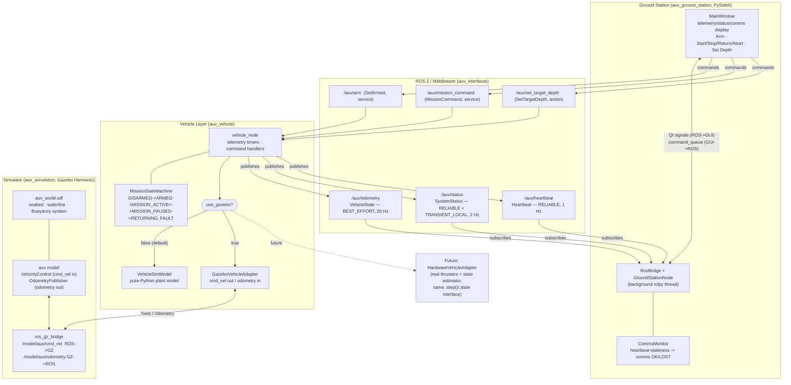

# AUV_int_task-2026 — Software Head Assessment

A ROS 2-based simulated AUV software stack: vehicle state/telemetry, a
command interface, a PySide6 ground station, and a Gazebo simulation
environment. Implements assessment items 1-5 for the **Software Head**
role (see the task brief for full wording).

| Item | What | Package |
|---|---|---|
| 1 | Vehicle State & Telemetry | `auv_vehicle` |
| 2 | Vehicle Command Interface | `auv_vehicle` |
| 3 | Ground Station | `auv_ground_station` |
| 4 | Simulation Environment | `auv_simulation` (+ `auv_vehicle/gazebo_adapter.py`) |
| 5 | System Architecture | this document |

## Architecture



**Flow in words:** the Ground Station never talks to the vehicle directly —
every telemetry value it shows and every command it sends goes through
ROS 2 topics/services/actions defined once in `auv_interfaces` and shared
by every package. `vehicle_node` owns the vehicle's actual state (via the
mission state machine) and is the only thing that ever writes to it;
whether that state is produced by simple arithmetic (`VehicleSimModel`) or
by a running physics simulation (`GazeboVehicleAdapter` + Gazebo, over
`ros_gz_bridge`) is a single parameter (`use_gazebo`) and invisible to
everything else in the diagram. The dashed box is not implemented — it's
the modularity payoff this boundary is designed for: real hardware
integration replaces the Gazebo box with a thruster/sensor driver behind
the identical interface.

### Why this shape

- **`auv_interfaces` as its own package.** Every other package depends
  only on this thin interface package, never on each other's internals —
  `auv_ground_station` doesn't know `VehicleSimModel` exists, and
  `auv_simulation` doesn't know ROS 2 exists at all (see below).
- **`auv_simulation` contains zero ROS 2 nodes.** It only stands up Gazebo
  and a bridge; `GazeboVehicleAdapter` (in `auv_vehicle`) is the only
  thing that speaks ROS 2 to it. This keeps "how do we simulate the
  vehicle" and "how do we run the vehicle's software" as separately
  testable, separately replaceable concerns — matching how a real
  hardware bring-up would separate "the vehicle" from "the software that
  runs on it."
- **One state owner.** `vehicle_node` is the only writer of vehicle state;
  the Ground Station is read-only except for the explicit command
  interface. This avoids the two-sources-of-truth problem an
  independent telemetry node and command node would have created (see
  `auv_vehicle/README.md`, "Why one node, not two").
- **QoS chosen per topic's actual reliability contract**, not one profile
  for everything — high-rate telemetry can drop a sample, status/heartbeat
  cannot. Full rationale in `auv_vehicle/auv_vehicle/qos_profiles.py`.

## Package structure

```
AUV_int_task-2026/
  src/
    auv_interfaces/       # shared msg/srv/action definitions (items 1, 2)
    auv_vehicle/           # telemetry + command interface + mission FSM (items 1, 2)
                            # + VehicleSimModel and GazeboVehicleAdapter (item 4's node-side half)
    auv_ground_station/    # PySide6 GUI (item 3)
    auv_simulation/        # Gazebo world/model/bridge, no ROS 2 nodes (item 4's sim-side half)
```

Each package has its own README with component-level design decisions —
start there for the reasoning behind a specific choice; this document is
the map, not the territory.

## Install

before installing python on whole system consider using python virtual environment for the same for smooth working and no conflicts.

```bash
# ROS 2 (Jazzy, for Ubuntu 24.04) if not already installed
sudo apt install ros-jazzy-desktop

# Gazebo Harmonic + the ROS 2 <-> Gazebo bridge (item 4 only)
sudo apt install ros-jazzy-ros-gz ros-jazzy-ros-gz-sim ros-jazzy-ros-gz-bridge

# Ground station GUI's one non-ROS dependency
pip install PySide6 --break-system-packages
```

## Build

```bash
cd ~/AUV_int_task-2026
source /opt/ros/jazzy/setup.bash
colcon build
source install/setup.bash
```

## Run

```bash
# Items 1-3 only, no Gazebo (fastest way to exercise telemetry/commands/GUI):
ros2 launch auv_ground_station full_stack.launch.py initial_armed:=true sim_seed:=42

# Everything, including item 4 (Gazebo simulation backend):
ros2 launch auv_ground_station full_sim_stack.launch.py initial_armed:=true
```

Either command opens the Ground Station GUI; with `full_sim_stack.launch.py`,
the Gazebo window also opens and the AUV model visibly moves as telemetry
updates. See each package's README for component-level run instructions
(launching `vehicle_node` alone, running unit tests without ROS, etc.).

## Known simplifications

Each package's README names the simplifications specific to it (mission
FAULT handling in `auv_vehicle`, hydrodynamics/battery in
`auv_simulation`). None are oversights — they're scope cuts made to keep
the submission's actual evaluation criteria (ROS 2 architecture, QoS
choices, communication reliability, code quality) in focus rather than
building, e.g., a Fossen-equations hydrodynamics model that this
assessment does not ask for.
